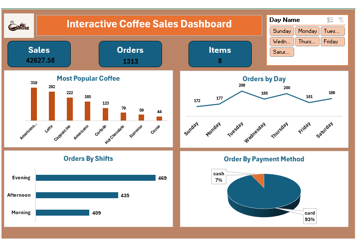

☕ Coffee Sales Analysis Dashboard
Overview
An interactive dashboard built with Microsoft Excel to transform raw sales data into actionable business insights. This project helps in understanding customer behavior and optimizing shop operations.

Key Insights

Total Revenue: $42.6k from 1,313 orders.

Top Products: Americano & Latte are the highest sellers.

Peak Times: Tuesdays and Evening shifts have the highest traffic.

Payments: 93% of customers prefer Card over Cash.

Skills Demonstrated
Data Cleaning & Preparation.

Pivot Tables & Slicers.

Data Visualization & Dashboard Design.
